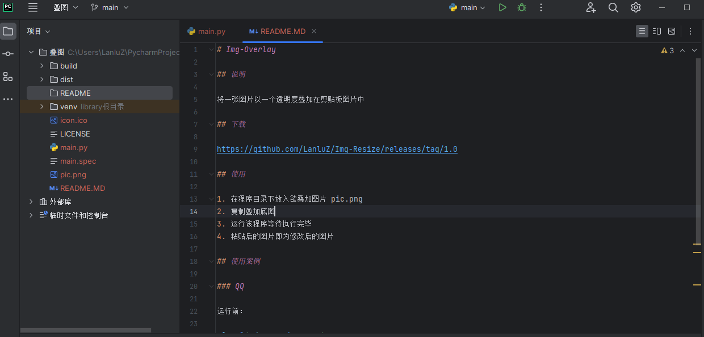
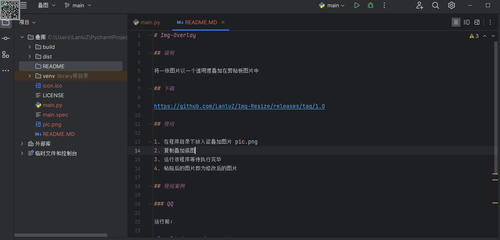

# Img-Overlay

## 说明

将一张图片以一个透明度叠加在剪贴板图片中

## 下载

https://github.com/LanluZ/Img-Overlay/releases/tag/1.0

## 使用   

1. 在程序目录下放入欲叠加图片 pic.png
2. 复制叠加底图
3. 运行该程序等待执行完毕
4. 粘贴后的图片即为修改后的图片

## 使用案例

### QQ

运行前：

运行后：

